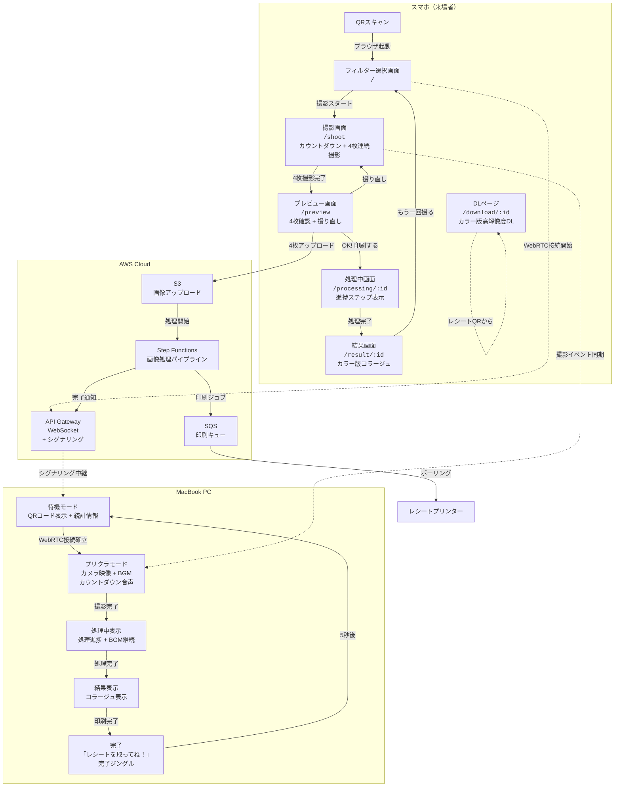
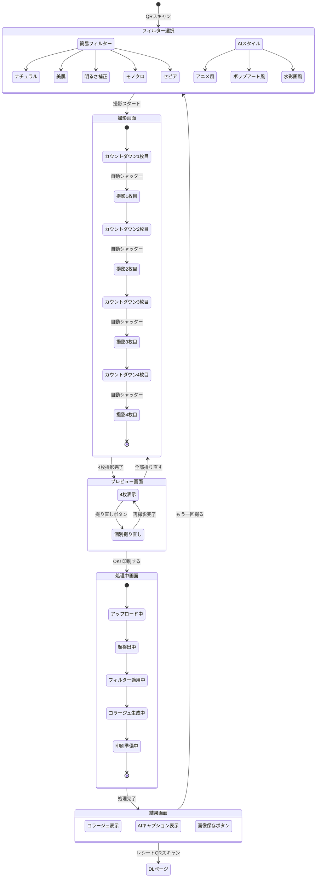
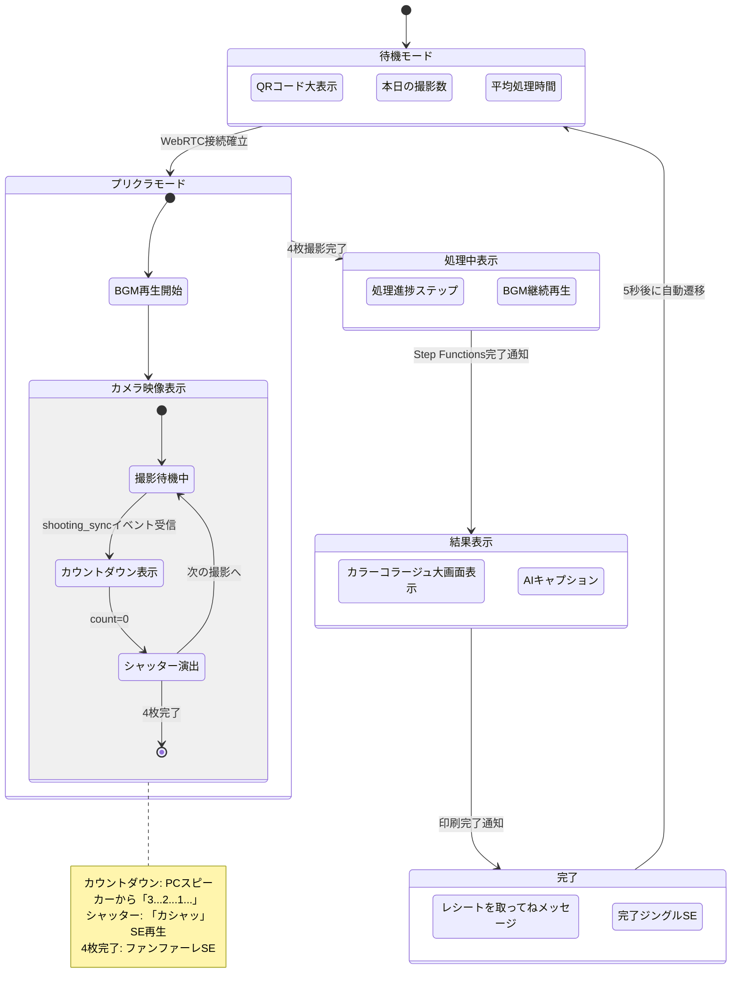
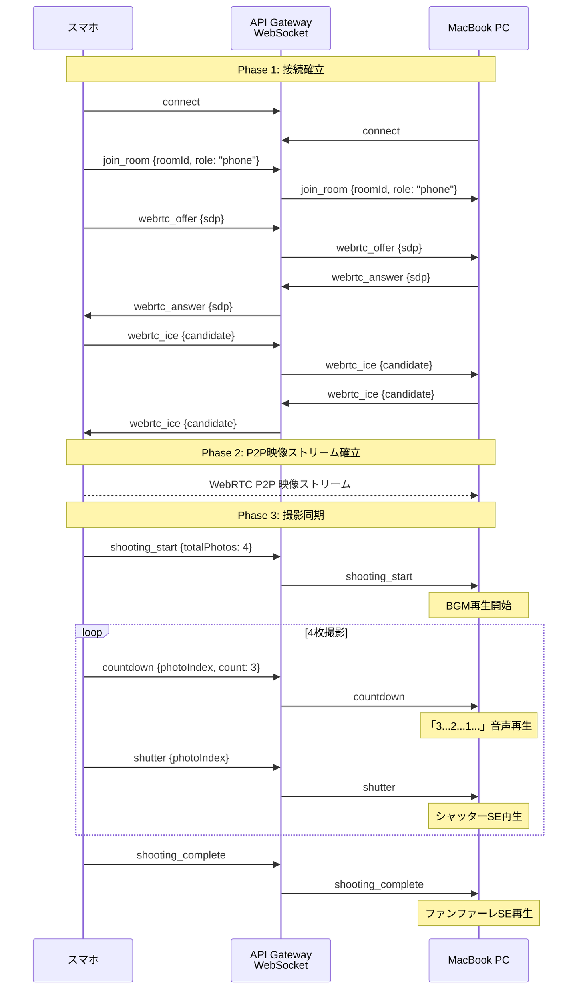

# Receipt Purikura - 画面遷移図

> **最終更新日**: 2026-03-04

---

## 全体フロー（スマホ + PC連携）

```mermaid
flowchart TB
    subgraph Phone["スマホ（来場者）"]
        P_QR["QRスキャン"]
        P_Filter["フィルター選択画面<br/><code>/</code>"]
        P_Shoot["撮影画面<br/><code>/shoot</code><br/>カウントダウン + 4枚連続撮影"]
        P_Preview["プレビュー画面<br/><code>/preview</code><br/>4枚確認 + 撮り直し"]
        P_Process["処理中画面<br/><code>/processing/:id</code><br/>進捗ステップ表示"]
        P_Result["結果画面<br/><code>/result/:id</code><br/>カラー版コラージュ"]
        P_DL["DLページ<br/><code>/download/:id</code><br/>カラー版高解像度DL"]
    end

    subgraph PC["MacBook PC"]
        PC_Idle["待機モード<br/>QRコード表示 + 統計情報"]
        PC_Purikura["プリクラモード<br/>カメラ映像 + BGM<br/>カウントダウン音声"]
        PC_Process["処理中表示<br/>処理進捗 + BGM継続"]
        PC_Result["結果表示<br/>コラージュ表示"]
        PC_Done["完了<br/>「レシートを取ってね！」<br/>完了ジングル"]
    end

    subgraph AWS["AWS Cloud"]
        S3["S3<br/>画像アップロード"]
        SF["Step Functions<br/>画像処理パイプライン"]
        SQS["SQS<br/>印刷キュー"]
        WS["API Gateway<br/>WebSocket<br/>+ シグナリング"]
    end

    Printer["レシートプリンター"]

    P_QR -->|ブラウザ起動| P_Filter
    P_Filter -->|撮影スタート| P_Shoot
    P_Shoot -->|4枚撮影完了| P_Preview
    P_Preview -->|撮り直し| P_Shoot
    P_Preview -->|OK! 印刷する| P_Process
    P_Process -->|処理完了| P_Result
    P_Result -->|もう一回撮る| P_Filter

    P_Filter -.->|WebRTC接続開始| WS
    WS -.->|シグナリング中継| PC_Idle
    PC_Idle -->|WebRTC接続確立| PC_Purikura
    P_Shoot -.->|撮影イベント同期| PC_Purikura
    PC_Purikura -->|撮影完了| PC_Process
    PC_Process -->|処理完了| PC_Result
    PC_Result -->|印刷完了| PC_Done
    PC_Done -->|5秒後| PC_Idle

    P_Preview -->|4枚アップロード| S3
    S3 -->|処理開始| SF
    SF -->|完了通知| WS
    SF -->|印刷ジョブ| SQS
    SQS -->|ポーリング| Printer

    P_DL -.->|レシートQRから| P_DL
```

## スマホ画面遷移（詳細）

```mermaid
stateDiagram-v2
    [*] --> フィルター選択: QRスキャン

    state フィルター選択 {
        簡易フィルター --> ナチュラル
        簡易フィルター --> 美肌
        簡易フィルター --> 明るさ補正
        簡易フィルター --> モノクロ
        簡易フィルター --> セピア
        AIスタイル --> アニメ風
        AIスタイル --> ポップアート風
        AIスタイル --> 水彩画風
    }

    フィルター選択 --> 撮影画面: 撮影スタート

    state 撮影画面 {
        [*] --> カウントダウン1枚目
        カウントダウン1枚目 --> 撮影1枚目: 自動シャッター
        撮影1枚目 --> カウントダウン2枚目
        カウントダウン2枚目 --> 撮影2枚目: 自動シャッター
        撮影2枚目 --> カウントダウン3枚目
        カウントダウン3枚目 --> 撮影3枚目: 自動シャッター
        撮影3枚目 --> カウントダウン4枚目
        カウントダウン4枚目 --> 撮影4枚目: 自動シャッター
        撮影4枚目 --> [*]
    }

    撮影画面 --> プレビュー画面: 4枚撮影完了

    state プレビュー画面 {
        4枚表示 --> 個別撮り直し: 撮り直しボタン
        個別撮り直し --> 4枚表示: 再撮影完了
    }

    プレビュー画面 --> 撮影画面: 全部撮り直す
    プレビュー画面 --> 処理中画面: OK! 印刷する

    state 処理中画面 {
        [*] --> アップロード中
        アップロード中 --> 顔検出中
        顔検出中 --> フィルター適用中
        フィルター適用中 --> コラージュ生成中
        コラージュ生成中 --> 印刷準備中
        印刷準備中 --> [*]
    }

    処理中画面 --> 結果画面: 処理完了

    state 結果画面 {
        コラージュ表示
        AIキャプション表示
        画像保存ボタン
    }

    結果画面 --> フィルター選択: もう一回撮る
    結果画面 --> DLページ: レシートQRスキャン
```

## PC画面遷移（詳細）

```mermaid
stateDiagram-v2
    [*] --> 待機モード

    state 待機モード {
        QRコード大表示
        本日の撮影数
        平均処理時間
    }

    待機モード --> プリクラモード: WebRTC接続確立

    state プリクラモード {
        [*] --> BGM再生開始
        BGM再生開始 --> カメラ映像表示

        state カメラ映像表示 {
            [*] --> 撮影待機中
            撮影待機中 --> カウントダウン表示: shooting_syncイベント受信
            カウントダウン表示 --> シャッター演出: count=0
            シャッター演出 --> 撮影待機中: 次の撮影へ
            シャッター演出 --> [*]: 4枚完了
        }

        note right of カメラ映像表示
            カウントダウン: PCスピーカーから「3...2...1...」
            シャッター: 「カシャッ」SE再生
            4枚完了: ファンファーレSE
        end note
    }

    プリクラモード --> 処理中表示: 4枚撮影完了

    state 処理中表示 {
        処理進捗ステップ
        BGM継続再生
    }

    処理中表示 --> 結果表示: Step Functions完了通知

    state 結果表示 {
        カラーコラージュ大画面表示
        AIキャプション
    }

    結果表示 --> 完了: 印刷完了通知

    state 完了 {
        レシートを取ってねメッセージ
        完了ジングルSE
    }

    完了 --> 待機モード: 5秒後に自動遷移
```

## WebRTC + WebSocket 通信フロー

```mermaid
sequenceDiagram
    participant Phone as スマホ
    participant WS as API Gateway<br/>WebSocket
    participant PC as MacBook PC

    Note over Phone, PC: Phase 1: 接続確立
    Phone->>WS: connect
    PC->>WS: connect
    Phone->>WS: join_room {roomId, role: "phone"}
    WS->>PC: join_room {roomId, role: "phone"}
    Phone->>WS: webrtc_offer {sdp}
    WS->>PC: webrtc_offer {sdp}
    PC->>WS: webrtc_answer {sdp}
    WS->>Phone: webrtc_answer {sdp}
    Phone->>WS: webrtc_ice {candidate}
    WS->>PC: webrtc_ice {candidate}
    PC->>WS: webrtc_ice {candidate}
    WS->>Phone: webrtc_ice {candidate}

    Note over Phone, PC: Phase 2: P2P映像ストリーム確立
    Phone-->>PC: WebRTC P2P 映像ストリーム

    Note over Phone, PC: Phase 3: 撮影同期
    Phone->>WS: shooting_start {totalPhotos: 4}
    WS->>PC: shooting_start
    Note over PC: BGM再生開始

    loop 4枚撮影
        Phone->>WS: countdown {photoIndex, count: 3}
        WS->>PC: countdown
        Note over PC: 「3...2...1...」音声再生
        Phone->>WS: shutter {photoIndex}
        WS->>PC: shutter
        Note over PC: シャッターSE再生
    end

    Phone->>WS: shooting_complete
    WS->>PC: shooting_complete
    Note over PC: ファンファーレSE再生
```

## 音声タイミングチャート

```mermaid
gantt
    title PC側音声タイムライン（1セッション）
    dateFormat ss
    axisFormat %S秒

    section BGM
    BGMループ再生               :active, bgm, 00, 40

    section カウントダウン
    1枚目 3...2...1             :cd1, 02, 3
    2枚目 3...2...1             :cd2, 08, 3
    3枚目 3...2...1             :cd3, 14, 3
    4枚目 3...2...1             :cd4, 20, 3

    section シャッターSE
    1枚目シャッター             :sh1, 05, 1
    2枚目シャッター             :sh2, 11, 1
    3枚目シャッター             :sh3, 17, 1
    4枚目シャッター             :sh4, 23, 1

    section 完了SE
    撮影完了ファンファーレ       :done1, 24, 2
    印刷完了ジングル             :done2, 38, 2
```
